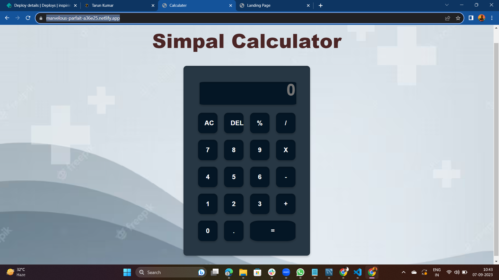

# Project README

## Landing Page

### Description
This section provides an overview of the landing page task.

The landing page is the first thing visitors will see when they access your website. It serves as an introduction to your project and sets the tone for the rest of the site.

### Features
- Briefly describe the key features of the landing page.
- Highlight any special elements, animations, or interactive components.

### Deploy
Link :    <a href="https://inspiring-cocada-684dd0.netlify.app/">Landing Page</a>

## Calculator

### Description
This section provides an overview of the calculator task.

The calculator is a tool that allows users to perform mathematical calculations. It can be a simple or complex calculator, depending on your project requirements.

### Features
- List the mathematical operations supported by the calculator (e.g., addition, subtraction, multiplication, division).
- Describe any advanced features or functionality.

### Deploy
Link :    <a href="https://marvelous-parfait-a36e25.netlify.app/">Calculator</a>

## Portfolio

### Description
This section provides an overview of the portfolio task.

A portfolio showcases your work, skills, and achievements. It's a collection of projects and information that helps visitors understand your capabilities and accomplishments.

### Features
- Describe the projects or work samples included in your portfolio.
- Highlight any interactive elements or features that make your portfolio unique.

### Deploy
Link :    <a href="https://inspiring-pie-e758dc.netlify.app/">Portfolio</a>
